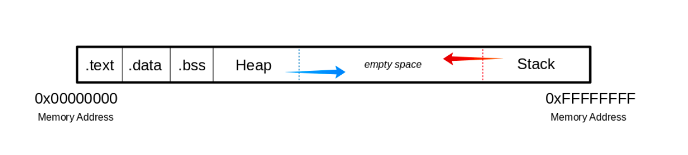

# Binary Exploitation:

## Stack Based Buffer Overflow

- Occurs when the data is too large to fit into the buffer of of the OS's memory overflows this buffer.
    - Thus memory of other functions is overwritten.

- PE(Portable Executable Format) Used by Microsoft
- ELF(Executable and Linking Format) Used by unix systems

- For user inputs, a buffer is created beforehand
- Instructions are used to model the program flow. return addresses are stored in the memory, which refers to other memory addresses and thus define the program's control flow.
- Now if the return address is overwritten by using buffer overflow an attacker can maipulate program flow and return address of another function ro a subroutine. Or jupm back to a code previously injected by the user input.

### Memory

#### Buffer

##### .text
- Contains actual assembler instructions. Read-only mode to prevent porcesses form accidentally modifying its instructions. Any ***attempt to write*** to this area will inevitably result in a **segmentation fault**.

##### .data
- Contains global and static variables that are explicitly initialized by the program.

##### .bss
- 

#### The Heap

#### The Stack